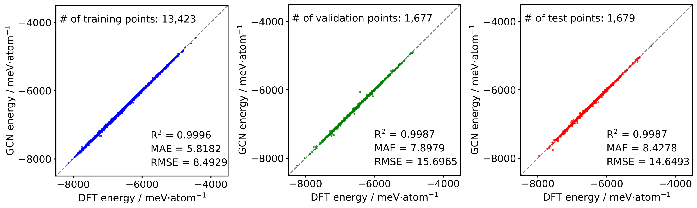
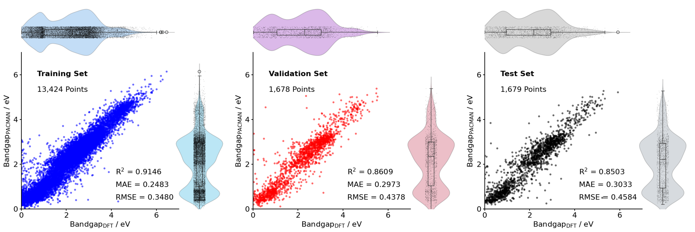

<h1 align="center">GCN Energy</h1>

<h4 align="center">
PBE energy & Bandgap Prediction by GCN models (Train from QMOF Database)                                                                 
</h4>                     
                     

# Installation                                                                                                            

**Download**                          

```sh
git clone https://github.com/sxm13/GCNEnergy.git
cd GCNEnergy
pip install -r requirements.txt
```                            
**OR**

```sh
pip install PACMAN-charge
``` 

# Energy Prediction               
           
```sh
python GCNEnergy.py folder-name[path]
```                          
* folder-name: relative path to a folder with cif files without partial atomic charges                            

**OR**
from PACMANCharge import pmcharge
pmcharge.Energy(cif_file="./test/Cu-BTC.cif")

# Models Performance        

#### PBE Energy
            
                               
#### Bandgap
   

# Reference
If you use GCN Energy, please consider citing [this paper](https://pubs.acs.org/doi/10.1021/acs.jctc.4c00434):                                           
```bib
@article{,
    title={PACMAN: A Robust Partial Atomic Charge Predicter for Nanoporous Materials based on Crystal Graph Convolution Network},
    DOI={10.1021/acs.jctc.4c00434},
    journal={Journal of Chemical Theory and Computation},
    author={Zhao, Guobin and Chung, Yongchul},
    year={2024}
}
```
